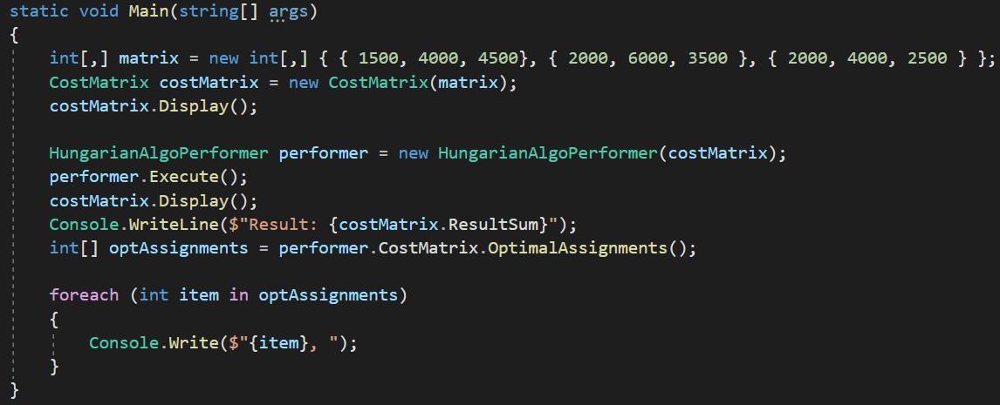
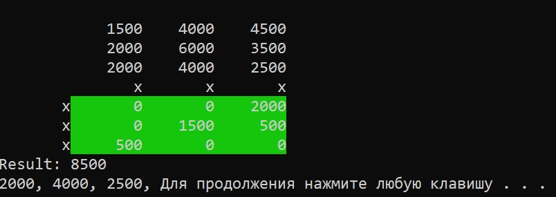

# hungarian-algorythm
An implementation of Hungarian Algorythm in C#.

This Algorythm is meant for the Job Assigning problem. It's purpose is to find an optimal solution of giving the "job" to "workers".
## Algorythm Description
Here in this implementation I'm using the so called Matrix interpretation of the algorythm

Given n workers and tasks, and an n by n matrix containing the cost of assigning each worker to a task, the task is to find the cost minimizing assignment.
1. First the problem is written in the form of a matrix where rows represent the workers and columns represent the tasks, the qworkers should do.
2. Find the smallest element of each individual row of the matrix.
3. Sustract the smallest number in the  row from each element of the row. This way zeroes will appear in the matrix.
4. Find minimum of every column. for the columns that allready have zeroes, the smallest number would be zero.
5. Substract the minimum of each column from every column's element.
6. Cover all the zeroes in new matrix with the minimum number of lines.
7. If the minimum number of lines is equal to matrix's number of rows, than the optimal assignment is possible and the algorythm is complete. Otherwise proceed further.
8. Subtract the smallest uncovered entry of the Matrix from all uncovered rows.
9. Add the smallest entry to all covered columns.
10. Return to step 7 to check if the assignment is possible.

## Program Classes
### CostMatrix
Represents the matrix with the costs of each of the jobs for each worker.
#### Properties
- `Matrix` - contains the costs of the jobs.
- `MatrixBackup` contains the original matrix. It's necessary because during the processing of the algorythm `Matrix` get's changed and in's impossible to tell what numbers were there originally in the matrix.
- `MarkedRows` and `MarkedColls` contain `true` values on the rows or columns that were marked during searching for minimum number of lines to cover zeroes in step 7 of the algorythm.
- `HighlightedRows` and `HighlightedColls` contain 'true' on the rows and columns that were highlighted with lines in step 7.
- `ResultSum` contains the sum of cost of the optimal assignment.
- `NumberOfRows` and `NumberOfColls` return the number of rows and columns in matrix respectively.
#### Methods
- `void SubstractFromRow(int rowNumber, int number)` and `void SubstractFromColl(int collNumber, int number)` fullfil steps 2-5 of the algorythm above with a help of functions `int GetMinOfTheRow(int rowNumber)` and `int GetMinOfTheColl(int rowNumber)`. Additinally this method adds the substracted value to `ResultSum` to calculate the sum of the optimal assignment.
- `void Display()` displays the `Matrix'. The Marked Rows and columns are marked with `X` sign on the output. Highlighted rows and columns are coloured green.
- `void CoverZeroes()` performs operation of covering all the zeroes in the matrix with the minimum number of lines. (Step 7 of the algorythm above.)
- `public void SubstractSmallestUncovered()` substracts the smallest number that was not covered by the lines from covered rows and adds it to colls that were covered. (Steps 8-9 of the algorythm above)
- `public int NumberOfLines()` calculates number of covered lines in the matrix.
- `public int[] OptimalAssignments()` finds the array of costs of the job assignments that belong to optimal assignment.
### HungarianAlgoPerformer
Performs all the steps under the `CostMatrix` in the right order to achieve optimal assignment on the given Matrix.
#### Properties
- `CostMatrix` contains the matrix of costs for job assignment.
- `public void Execute()` executes the hungarian algorythm's steps on the `CostMatrix` in the right order and gets the optimal solution from it.
## Code Usage Examples
The following exaple shows example of usage of the code and the output of this particular usage.

